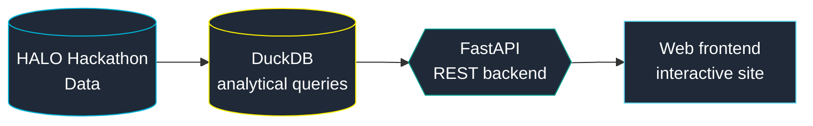

 

---

## 👋 Hey, I'm Nick Sofianakos

I'm a **Technology Consultant at Ernst & Young** in the New York City Metropolitan Area, working within the **Artificial Intelligence and Data (AI&D)** practice. My journey in technology has been driven by curiosity and a commitment to continuous learning.

I excel at quickly mastering new concepts and technologies to design and deliver effective AI and data solutions for complex business challenges. Whether working independently or as part of a team, I bring dedication, creativity, and a process-oriented mindset to every project.

🎓 **Villanova University**, B.S. Computer Engineering (2024), minors in Statistics and Computer Science
Off the clock: working out, watching sports, and listening to music.

---

## 🛠️ Skills

<table>
  <tr>
    <td width="200"><b>💻 Languages</b></td>
    <td>
      
      
      
      
       
      🚧 JavaScript is currently a work in progress as I continue honing my skills there.
    </td>
  </tr>
  <tr>
    <td><b>🌐 Web & Backend</b></td>
    <td>
      
      
      
      
      
    </td>
  </tr>
  <tr>
    <td><b>📊 Data & Analysis</b></td>
    <td>
      
      
      
      
      
      
      
    </td>
  </tr>
  <tr>
    <td><b>☁️ Tools & Platforms</b></td>
    <td>
      
      
      
      
      
      
    </td>
  </tr>
  <tr>
    <td><b>🗄️ Databases</b></td>
    <td>
      
      
      
      
    </td>
  </tr>
  <tr>
    <td><b>🧪 Testing & DevOps</b></td>
    <td>
      
      
      
      
      
    </td>
  </tr>
  <tr>
    <td><b>🤖 AI & GenAI</b></td>
    <td>
      
      
      
      
    </td>
  </tr>
</table>

---

## 🔭 What I'm Building & Exploring Right Now

### 🏒 HALO Hackathon: FastAPI + DuckDB Full-Stack Website

I'm building a **full-stack website powered by a FastAPI backend** on top of the **HALO Hackathon data**. It's a hands-on way to show how I use **FastAPI** and **DuckDB** together to turn raw data into an interactive product.

| | What it demonstrates |
|---|---|
| ⚡ **FastAPI** | Designing and serving a typed, high-performance API backend |
| 🦆 **DuckDB** | Fast in-process analytical SQL over the hackathon dataset |
| 🌐 **Full-stack** | Connecting the data layer, API, and a web frontend end to end |

> 🚧 **Status:** actively in progress. Watch my [repositories](https://github.com/Nick3429?tab=repositories) for updates.

---

## 🏅 Certifications

| Provider | Certification | Credential | Year |
|:---:|:---|:---:|:---:|
|  | **Data Engineer** | Associate | 2025 |
|  | **Generative AI Engineer** | Associate | 2025 |
|  | **Data Analyst** | Associate | 2025 |
|  | **Azure Fundamentals** | AZ-900 | 2025 |
|  | **Azure AI Fundamentals** | AI-900 | 2025 |
|  | **Azure Data Fundamentals** | DP-900 | 2025 |

---

## 📈 GitHub Stats

---

## 🤝 Let's Connect

I'm always happy to talk AI, data, cloud, or sports analytics. Reach out about a project, a question about my portfolio, or just to say hi.

**🔗 [linkedin.com/in/nick-sofianakos](https://www.linkedin.com/in/nick-sofianakos/)  ·  ✉️ [nsofianakos@gmail.com](mailto:nsofianakos@gmail.com)**

